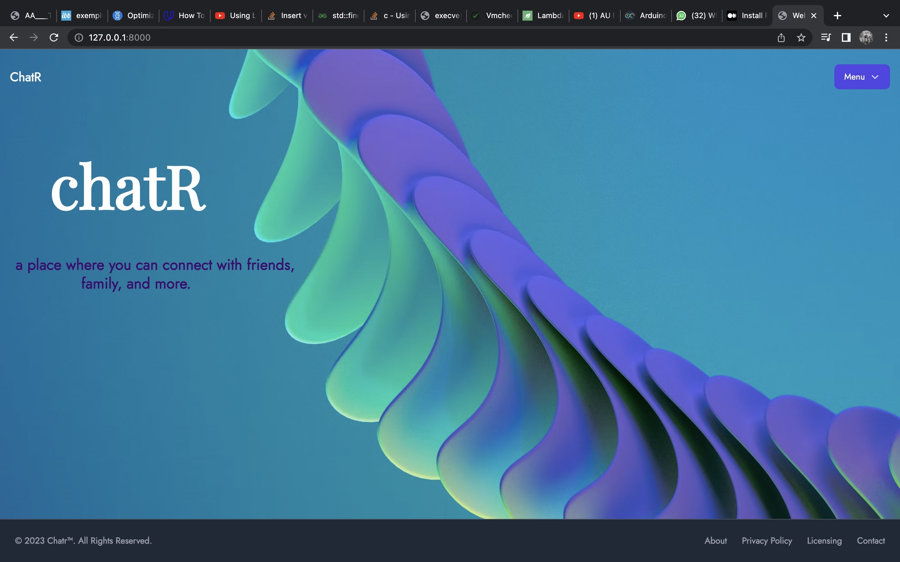
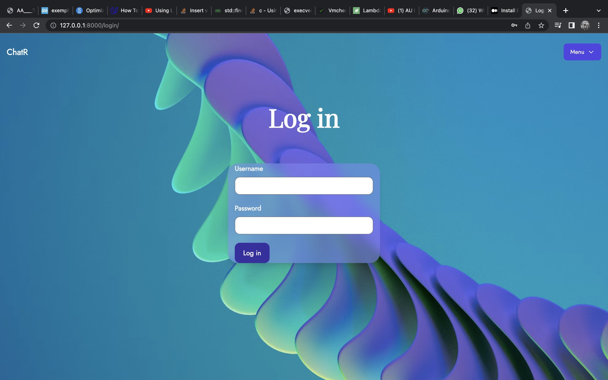
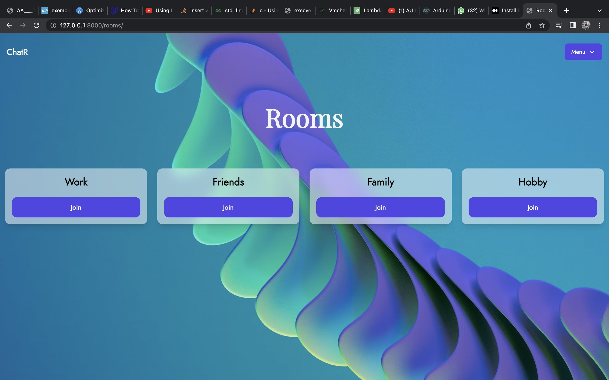
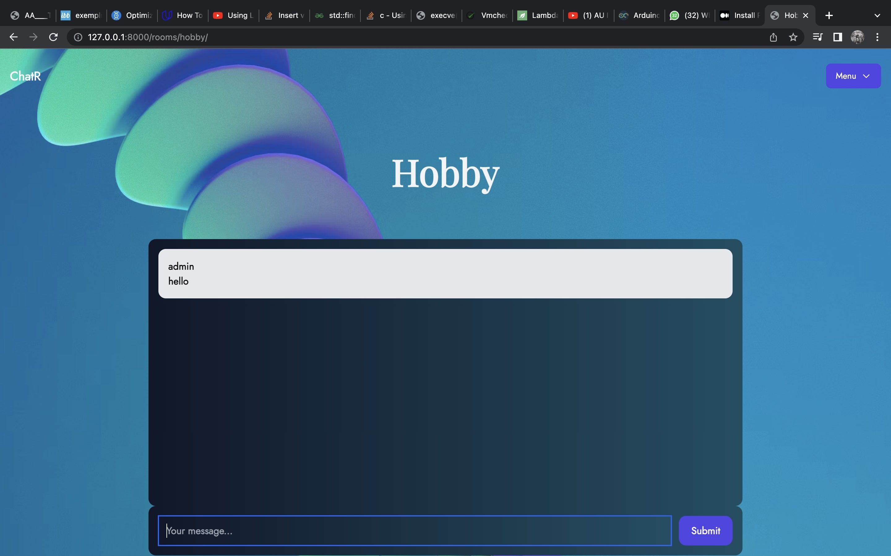
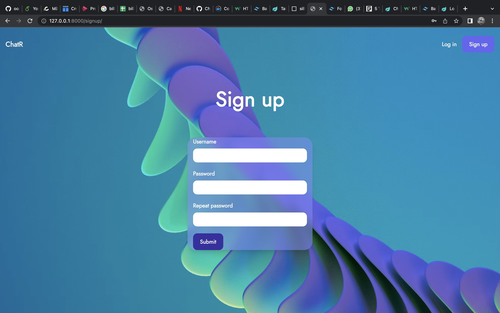
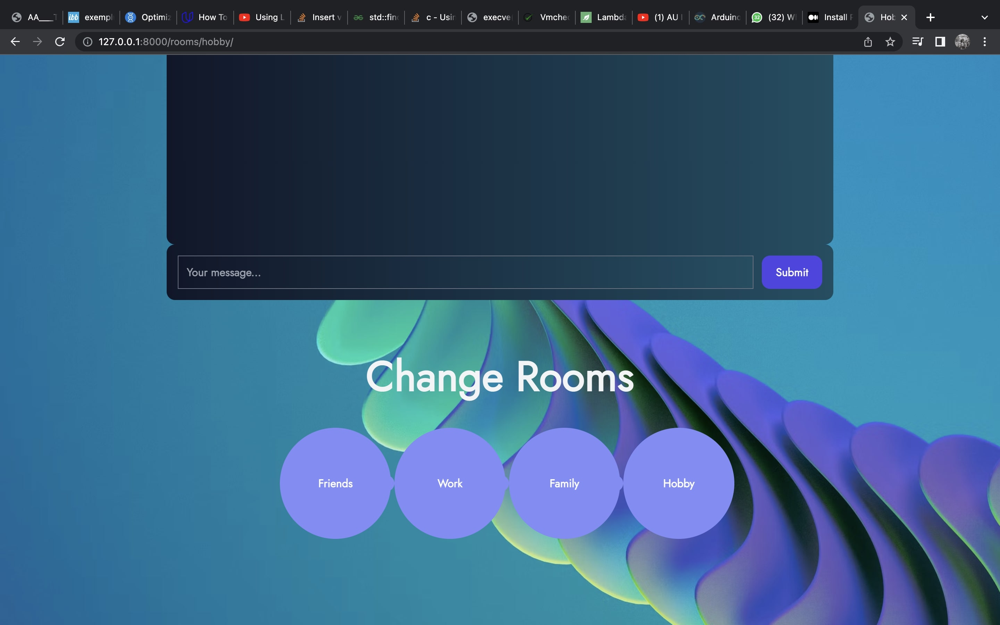

### Team members: Bianca Popa, Adriana Dobrica, Mirza Ana-Maria, Andrei Mihail Calin

# ChatR - Chat Website 

## Description
Chatr, as the name implies, is a real time chat website that allows users to communicate in selected rooms. Having several rooms, users can enjoy the experience of chatting with friends and family, and even other users, on a chosen topic. Want to organize an event? Like maybe a picnic? Or movie night? Choose the event room and discuss the organizing details: invite list, menu, location... or maybe.. you want to meet new people sharing your hobbies. One only has to go on the desired room and chat with users all around the world. The Chatr site allows users to register/login to an account, join any of the chat rooms available, and send messages. Also, the site ensures that messages are stored immediately and can be viewed right away. While the user has the ability to scroll on a conversation, the chat also scrolls on its own to the last message received. The admin of the app, or superuser, manages the rooms available and the list of users. He can delete users, create/delete rooms, and change permissions.

## Technologies Used

* Django with the package Channels - used for setting up the template of the application

* Tailwing CSS & HTML with the Django Template Engine System - used for the design and front-end of the website

* Python - used for the backend implementation

## How to run?

### Prerequisites
Install the following prerequisites, if not installed already, using the corresponding command in linux bash:

* python
```
sudo apt install python3
```

* pip
```
$ sudo apt install python3-pip
```

* django
```
$ sudo pip install django
```

* channels
```
$ sudo pip install channels==3.0.5
```

### Run

To start the server run the following commands:

```
$ django-admin startproject chatr
```

Add the Chatr folder to the created environment and then run:

```
$ python3 manage.py runserver
```
## Screenshots

### ChatR main frontpage:



### Log in page:



### Rooms page:



### Chat page:



### Sign up page:



### "Change room" component:



## Individual Work

Bianca Popa & Calin Andrei: 
 - backend

Adriana Dobrica & Mirza Ana-Maria:
- frontend


## Difficulties Encountered

One of the difficulties encoutered was not being able to run the server because of the different version of 'channels'. This problem might appear to certain computers. From lack of experience, uninstalling and installing the specified version of 'channels' did not solve the problem, and we had to test the app on a different machine.
